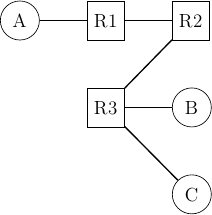

# Solutions semaine 2

## Open questions

1. À faire.

2. 
  
  Les *forwarding tables* étant vides, celles-ci sont construites au fur et à mesure de l'échange des paquets. Trois échanges sont effectués ; analysons-les en détail :
  
  1. **C envoie un paquet à B**
    
    C commence par envoyer à R3 au Nord-Ouest. R3 n'a jamais reçu de paquet de C. Il ajoute donc une entrée à sa *forwarding table* indiquant que C peut être contacté par le Sud-Est :
    
    | R3 | Dest. | Port. |
    ----------------------
    |    | C     | SE    |
    
    R3 ne sachant pas comment joindre B, il *broadcast* dans chacun de ses ports, au Nord-Est et à l'Est.
    
    Considérons en premier lieu le Nord-Est. R3 envoie à R2 par le Nord-Est. R2 n'a jamais reçu de paquet en provenance de C. Il ajoute donc une entrée à sa *forwarding table* indiquant que C peut être contacté par le Sud-Ouest :
    
    | R2 | Dest. | Port. |
    ----------------------
    |    | C     | SW    |
    
    R2 ne sachant pas comment joindre B, il *broadcast* dans chacun de ses ports, ici uniquement à l'Ouest. R2 envoie donc à R1 par l'Ouest. R1 n'a jamais reçu de paquet en provenance de C. Il ajoute donc une entrée à sa *forwarding table* indiquant que C peut être contacté par l'Est :
    
    | R1 | Dest. | Port. |
    ----------------------
    |    | C     | E     |
    
    R1 ne sachant pas comment joindre B, il *broadcast* dans chacun de ses ports, ici uniquement à l'Ouest. R1 envoie donc à 1 par l'Ouest. A reçoit un message qui ne lui est pas destiné, et s'en débarasse.
    
    Retournons à R3. En même temps que R3 avait envoyé au Nord-Est à R2, R3 envoie à B par l'Est. B reçoit donc le paquet qui lui était destiné.
  
  2. **A envoie un paquet à C**
    
    A commence par envoyer un paquet à R1 à l'Est. R1 reçoit le paquet à destination de C. Au passage, celui-ci découvre qu'il peut contacter A par l'Ouest. Il met donc à jour sa *forwarding table* :
    
    | R1 | Dest. | Port. |
    ----------------------
    |    | A     | W     |
    |    | C     | E     |
    
    Ensuite, R1 regarde sa *forwarding table* et trouve que C est joignable par l'Est. Il envoie donc le paquet à R2. R2 le reçoit et découvre qu'il peut contacter A par l'Ouest. Il met donc à jour sa *forwarding table* :
    
    | R2 | Dest. | Port. |
    ----------------------
    |    | A     | W     |
    |    | C     | SW    |
    
    Ensuite, R2 regarde sa *forwarding table* et trouve que C est joignable par le Sud-Ouest. Il envoie donc le paquet à R3. R3 le reçoit et découvre qu'il peut contacter A par le Nord-Est. Il met donc à jour sa *forwarding table* :
    
    | R3 | Dest. | Port. |
    ----------------------
    |    | A     | NE    |
    |    | C     | SE    |
    
    Ensuite, R3 regarde sa *forwarding table* et trouve que C est joignable par le Sud-Est. Il envoie donc le paquet à C.
    
  3. 
