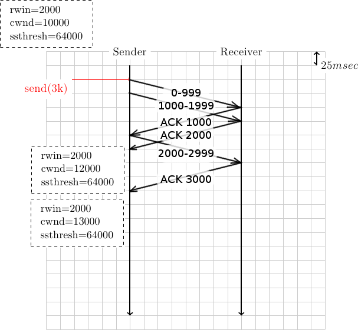
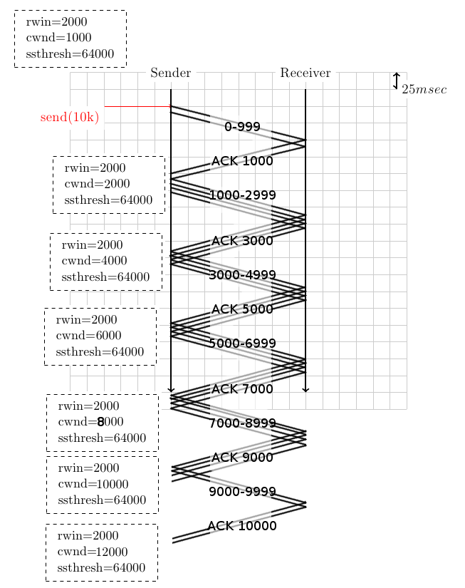
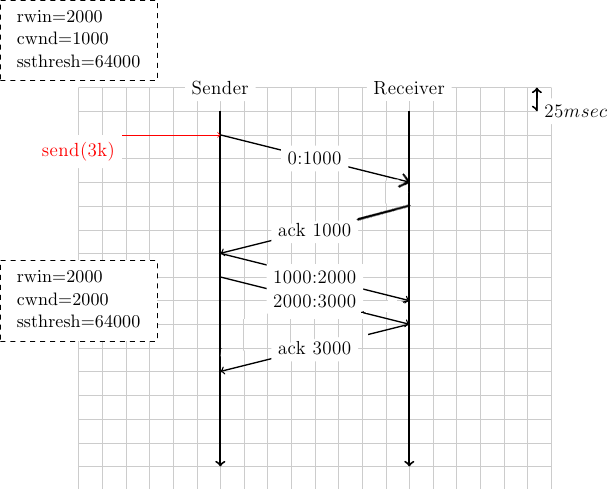
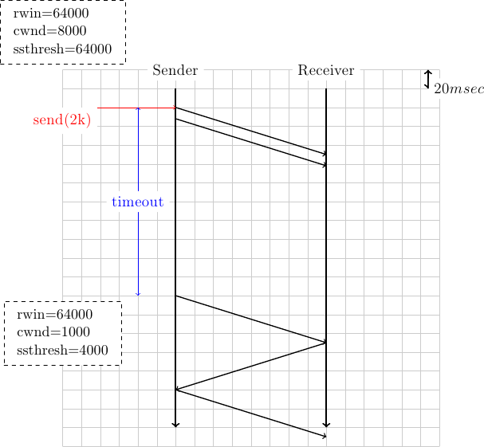
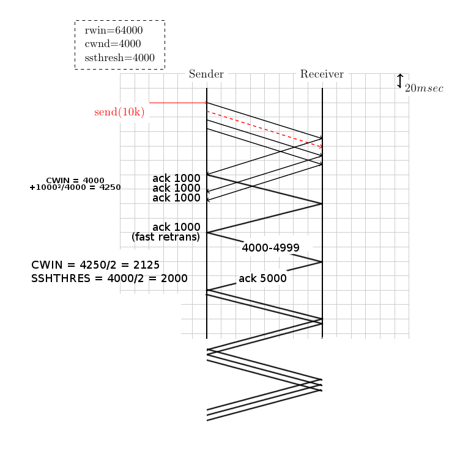

# Congestion control

Avant toute chose, notons que si CWIN est > que RWIN, on n'enverra que RWIN paquets et pas CWIN (http://moodleucl.uclouvain.be/pluginfile.php/1416262/mod_resource/content/1/CNP3.pdf, p174) 

#### 1. To understand the operation of the TCP congestion control, it is often useful to write time-sequence diagrams for different scenarios. The example below shows the operation of the TCP congestion control scheme in a very simple scenario. The initial congestion window (cwnd) is set to 1000 bytes and the receive window (rwin) advertised by the receiver (supposed constant for the entire connection) is set to 2000 bytes. The slow-start threshold (ssthresh) is set to 64000 bytes.

**Can you explain why the sender only sends one segment first and then two successive segments (the delay between the two segments on the figure is due to graphical reasons) ?**

Au début, le sender ne peut pas envoyer plus de 1000bytes car sa fenêtre de congestion est limitée à 1000bytes, soit un paquet. Ensuite, après avoir reçu le premier ACK, la fenêtre de congestion augmente à 2000bytes, soit 2 paquets. 

**Can you explain why the congestion window is increased after the reception of the first ack ?**

Pendant tout l'algorithme, on utilise l'algorithme de slow start (cwnd < sshthres). Cet algorithme stipule que l'on doit augmenter de 1MSS la fenêtre à chaque paquet reçu. Après le premier ACK, on doit donc l'augmenter de 1MSS, donc 1000bytes. 

**How long does it take for the sender to deliver 3 KBytes to the receiver ?**

Il a fallu 2fois un RTT + 1msec(temps de sérialisation), soit 201ms. 

#### 2.Same question as above but now with a small variation. Recent TCP implementations use a large initial value for the congestion window. Draw the time-sequence diagram that corresponds to an initial value of 10000 bytes for this congestion window.

Il faut exactement 2RTT, soit 200ms pour envoyer toutes les données. On commence par envoyer 2 paquets car la fenêtre de réception. En effet, la 
fenêtre d'envoi vaut le minimum entre la fenêtre de réception et celle de
congestion (ici, 2MSS). 

Ensuite, quand on reçoit un ACK, comme on est toujours en slow-start, on 
augmente la fenêtre de congestion de 1MSS. 

#### 3. Same question as the first one, but consider that the MSS on the sender is set to 500 bytes. How does this modification affect the entire delay ?

La solution de cette question est la suivante (nous avons 
représenté l'ensemble des ACK comme un seul grand ACK)

#### 4. Assuming that there are no losses and that there is no congestion in the network. If the sender writes x bytes on a newly established TCP connection, derive a formula that computes the minimum time required to deliver all these x bytes to the receiver. For the derivation of this formula, assume that x is a multiple of the maximum segment size and that the receive window and the slow-start threshold are larger than x.

Supposons que x = k.RTT 
Si rwin >> cwnd: on enverra en [log2(k)*RTT] arrondi au supérieur. 
Si on tient compte du temps de sérialisation, on doit ajouter 
(log2(k)-1) * le temps de sérialisation. 

Sii cette hypothèse n'est pas validée, c'est un petit peu plus complexe..

#### 5. In question 1, we assumed that the receiver acknowledged every segment received from the sender. In practice, many deployed TCP implementations use delayed acknowledgements. Assuming a delayed acknowledgement timer of 50 milliseconds, modify the time-sequence diagram below to reflect the impact of these delayed acknowledgement. Does their usage decreases or increased the transmission delay ?

On remarque que l'utilisation de delayed ACK a légèrement augmenté le délai car il a fallu attendre l'expiration du timer pour envoyer le premier ACK. 

#### 6. The congestion control scheme in a TCP implementation can operate in slow-start or in congestion avoidance mode. For this, the implementation compares the current value of the congestion window with the slow-start threshold.

Among the TCP states shown below, which is the one that corresponds to a connection operating in congestion avoidance ?

 * a) cwnd=4000 and ssthresh=8000
 * b) cwnd=4000 and ssthresh=2000
 * c) cwnd=4000 and ssthresh=48000

Seule la situation b correspond à "congestion avoidance" car on est au-délà
du seuil de slow start. 

#### 7. Let us now explore the impact of congestion on the slow-start and congestion avoidance mechanisms. Consider the scenario below. For graphical reasons, it is not possible anymore to show information about the segments on the graph, but you can easily infer them.

#### 8. A TCP has been active for some time and reached a congestion window of 8000 bytes (its initial value was 1000 bytes). At this point, there is no unacknowledged data and the application running on the sender tries to send 2000 bytes of data.

Il s'agit de la bonne solution car, en cas de congestion sévère, la cwin
retourne à sa valeur initiale (ici 1000bytes). 

#### 9. A TCP connection has been active for some time and has reached a congestion window of 4000 bytes. Four segments are sent, but the second (shown in red in the figure) is corrupted.

#### 10. Draw the complete time-sequence diagram for the scenario used in question 9.

